# serial2ti83 / ArduGrayLink
A program for Arduinos that makes it possible to connect a Texas Instruments calculator to a computer

## Introduction
This program turns an Arduino board into an adapter between a TI graphing calculator and a computer. In order to use it upload `serial2ti83.ino` to an Arduino board using the standard Arduino IDE and connect the 2.5mm jack port on the bottom of the TI calculator to the Arduino according to the following table:

| Jack port     | Arduino       | 
|:-------------:|:-------------:|
| sleeve        | GND pin       |
| tip           | Analog pin 0  |
| ring          | Analog pin 1  |
   
If you use Windows, you can now run some linking program, e.g. **TiLP** and start exchanging data (upload programs, take screenshots, dump ROM, manage variables, etc.). In case of TiLP make sure to go to File->Change Device first and choose **GrayLink** cable and TI-83 calc.

_Optional_: before uploading `serial2ti83.ino` you may wish to increase the size of hardware serial buffers to make the connection more reliable. This _might_ benefit particularly slow calculators, but after switching to direct port access, instead of digitalRead()/digitalWrite(), I no longer found this necessary (the serial buffer was never more than 32 bytes full even while transferring a several-kilobyte program to a TI-86). Open `HardwareSerial.h` from your Arduino installation folder (usually `C:\Program Files (x86)\Arduino\hardware\arduino\avr\cores\arduino`) and change these 2 lines:

    #define SERIAL_TX_BUFFER_SIZE 64
    #define SERIAL_RX_BUFFER_SIZE 64

to:

    #define SERIAL_TX_BUFFER_SIZE 256
    #define SERIAL_RX_BUFFER_SIZE 256

## Patching libticables to support this under Linux & boards that use ttyACM ex. Pro Micro, Digispark

**This isn´t recommended but it works**

First, get **libticables** from here: https://github.com/debrouxl/tilibs/ (git clone https://github.com/debrouxl/tilibs.git)

Then you need to run **autoreconf** and **configure** in the libticables/trunk folder (autoreconf -i -f && ./configure)

After that you need to patch some stuff @ libticables/trunk/src/linux

1. detect.c (So that we dont error out)

	replace **return ERR_TTDEV;** with **//return ERR_TTDEV;** @ **if(serinfo.type == PORT_UNKNOWN || serinfo.type == PORT_MAX)**
	
	Because else we become an error.

2. link_gry.c (So we use the right tty device)

	change **#define DEVNAME "ttyS"** to **#define DEVNAME "ttyACM"** (or the one of your Arduino) so that it uses the usb (gadget) serial device.

	also change 

		#elif defined(__LINUX__)
			flags = O_RDWR | O_SYNC;
		#endif
	
	to

		#elif defined(__LINUX__)
			flags = O_RDWR | O_SYNC | O_NOCTTY;
		#endif

And then run **make** and **(sudo) make install**

**IF** it doesnt get installed properly replace /usr/lib/libticables2.so.6 with the one from libticables/trunk/src/.libs/

(Sometimes the log gets spammed with ioctl errors. Unfortunatly i have no time to investigate this.)

If you run everything now it should say **"is usable: no"** and then **"is usable: yes"** in the console. 

This means everything should work ^^

## Schematic

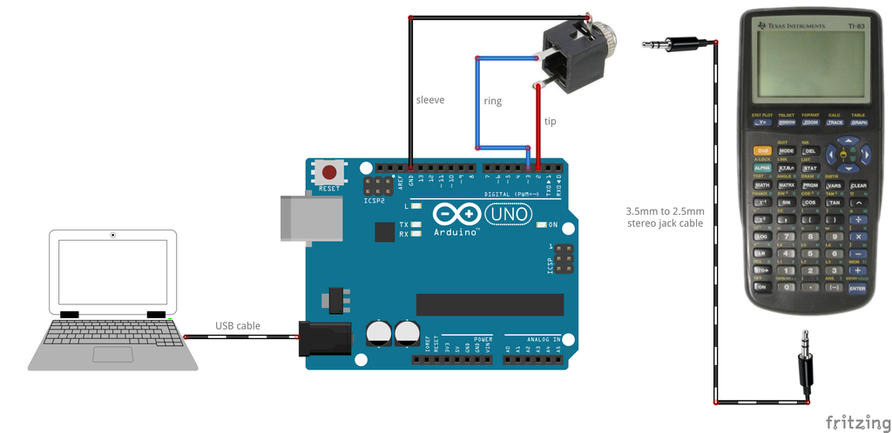

## Putting it in a box
Here is an example of how you can put an Arduino board inside a box and attach a 3.5mm jack socket to the box to make a device that is convenient to use.

### List of required items
* Arduino Uno board (or clone)
* plastic project box (search for "ABS Plastic Electronic Enclosure Project Box Black 103x64x40mm" on **Banggood**, it's about $3.5)

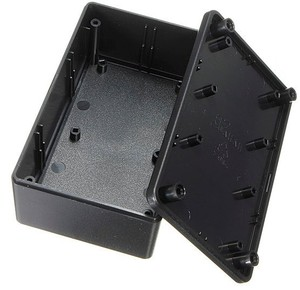

* 3.5mm panel mounted stereo jack socket (eBay, $0.99)

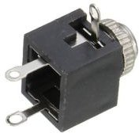

* nylon M3x10mm standoffs (eBay, $1.69 for 25 pieces)
* nylon M3x6mm philips screws (eBay, $1.79 for 25 pieces)
* 3.5mm to 2.5mm stereo jack cable (eBay, $0.99)

*Note: not every 2.5mm jack plug fits TI-83 smoothly. You may need to file away bits of plug's plastic housing so it goes all the way into the socket*

* some jumper cables
* basic tools (soldering iron, philips screwdriver, dremel tool, drill, files, etc.)

### Assembling the device

The first step is to attach standoffs to the Arduino board:

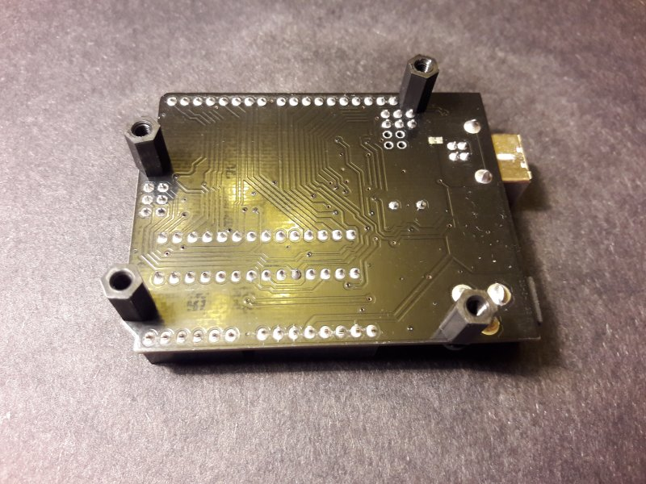

Sometimes you will need to file edges of the DC socket and connector headers to make space for screws.

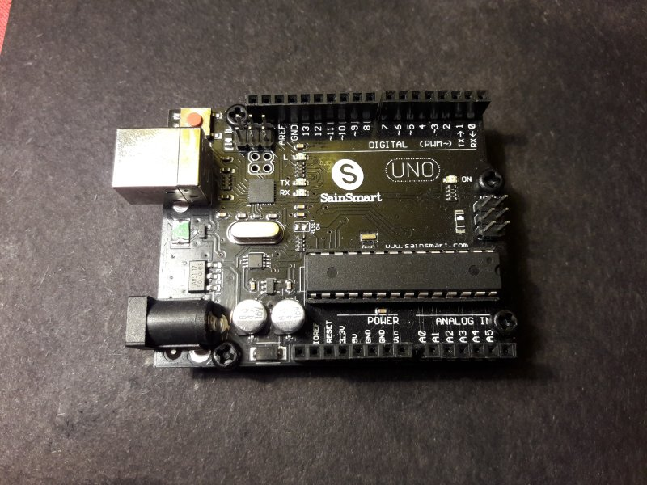

Drill 4 holes in the bottom part of the box. The holes should match Arduino's layout:

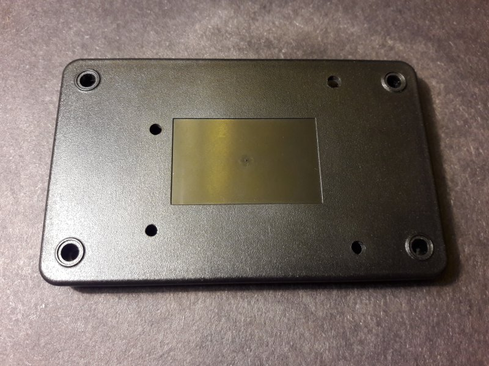

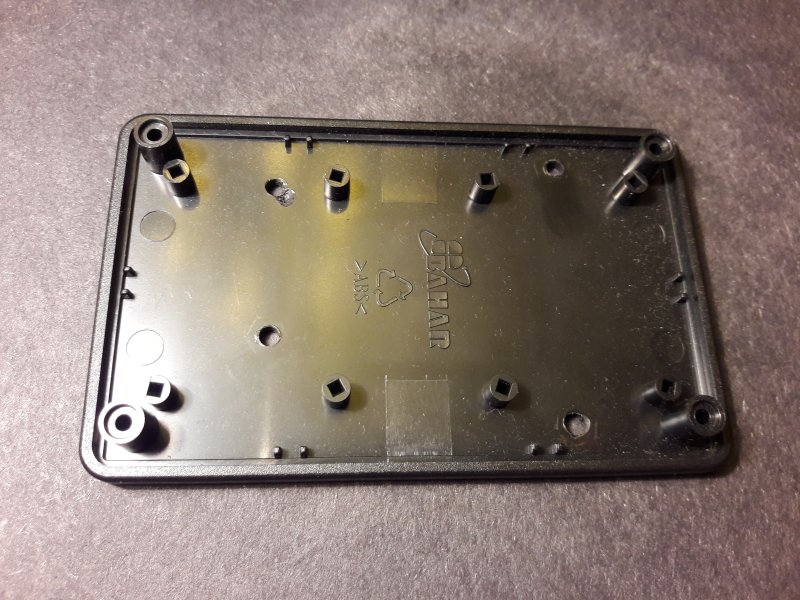

Screw the Arduino board to it:

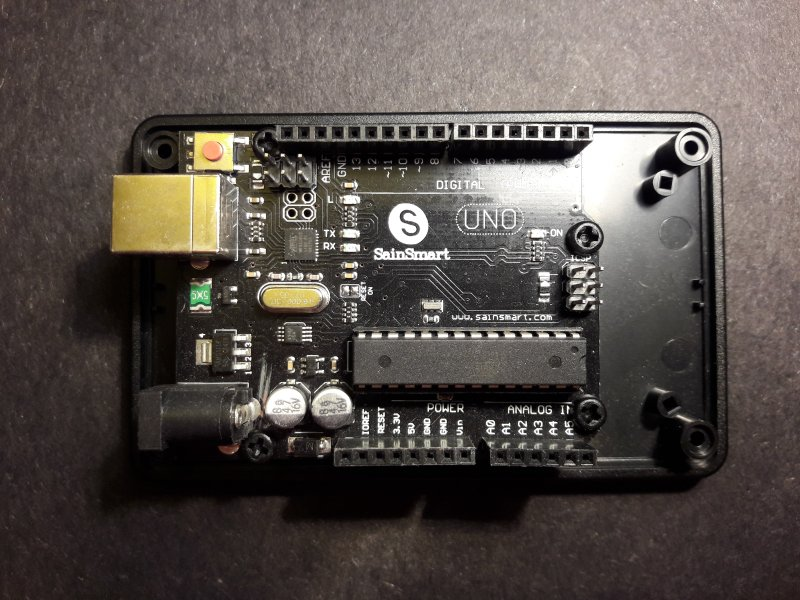

Make a rectangular opening for the USB plug in the top part of the box. You may use a drill and finish with a file. The opening should be correctly positioned so that it matches with the USB socket.

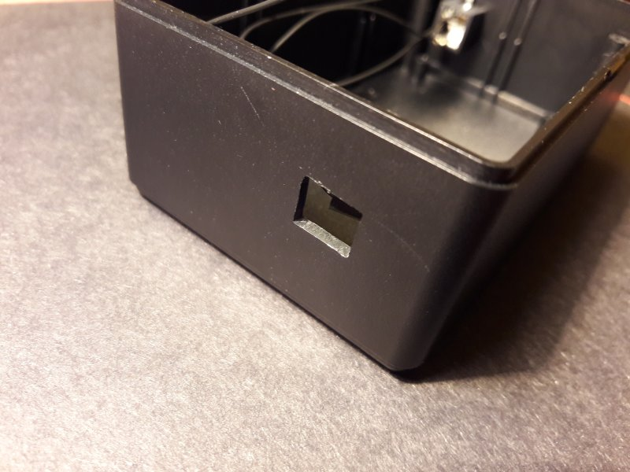

Drill a hole on the other side of the top part of the box and attach the 3.5mm jack socket. Solder 3 jumper cables to it.

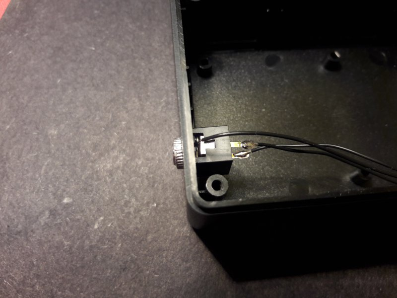

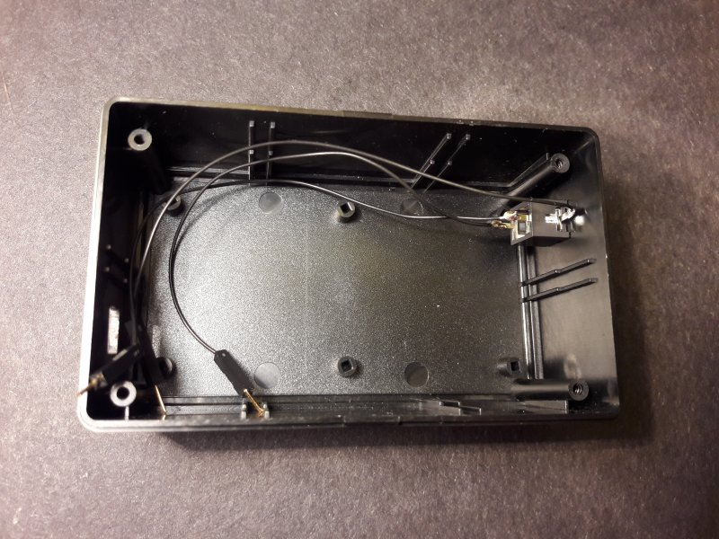

Connect the jumper cables to the Arduino (see schematic above).

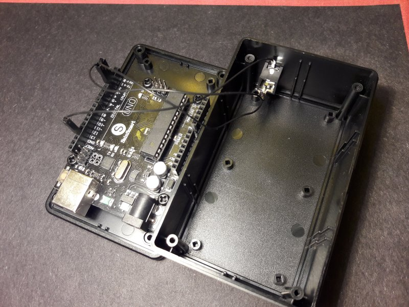

Assemble the box. Use the 4 screws included with it. This picture shows pins 2 and 3 in use, but now pins A0 and A1 are used.

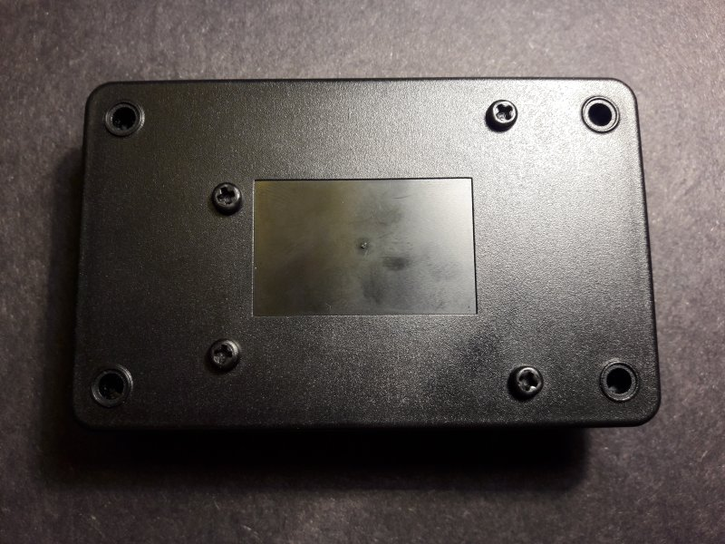

Insall 4 rubber feet:

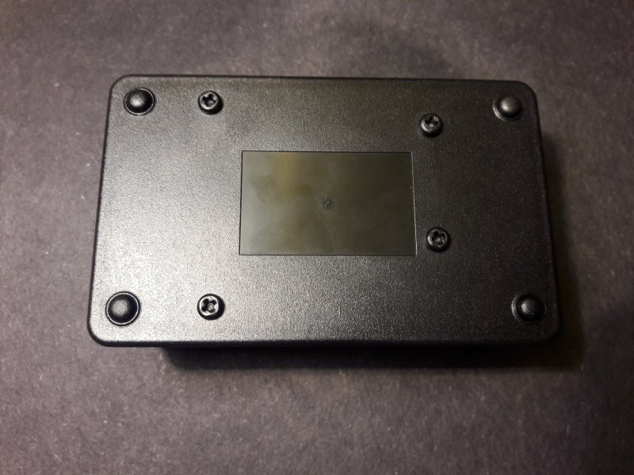

This is the final result:

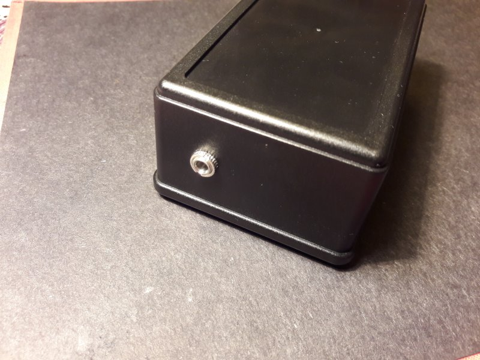

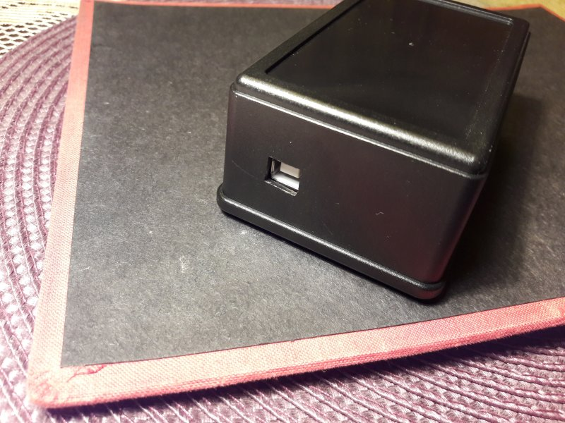

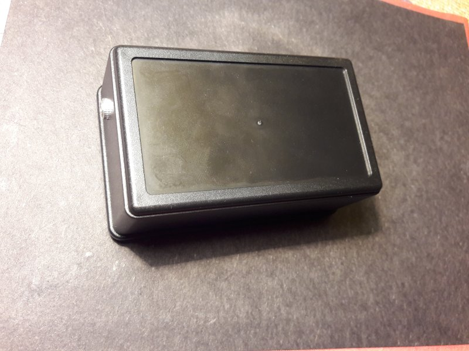
