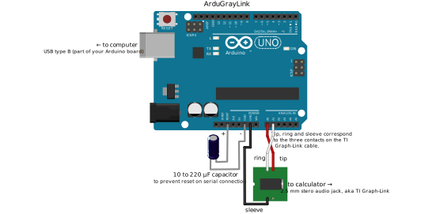

# serial2ti83 / ArduGrayLink
A program for Arduinos that makes it possible to connect a Texas Instruments calculator to a computer

## Introduction
This program turns an Arduino board into an adapter between a TI graphing calculator and a computer. In order to use it upload `serial2ti83.ino` to an Arduino board using the standard Arduino IDE and connect the 2.5mm jack port on the bottom of the TI calculator to the Arduino according to the following table:

| Jack port     | Arduino       | 
|:-------------:|:-------------:|
| sleeve        | GND pin       |
| tip           | Analog pin 0  |
| ring          | Analog pin 1  |

**For additional reliability**, add a 10–220 μF capacitor between the RESET pin and GROUND, as shown in the schematic. This prevents the Arduino from resetting when a program opens and closes the serial port, which TI Connect and TI GRAPH-LINK do often. If the program sends data while the Arduino is rebooting, it is likely to be lost. This is absolutely essential if you want to use TI GRAPH-LINK for Windows 3.1 under DOSBox.
   
If you use Windows, you can now run some linking program, e.g. **TiLP** and start exchanging data (upload programs, take screenshots, dump ROM, manage variables, etc.). In case of TiLP make sure to go to File->Change Device first and choose **GrayLink** cable and TI-83 calc.

The latest revision of ArduGrayLink will turn the Arduino board's builtin LED (connected to pin 13 on the Uno) if the serial buffer fills up past 50 bytes. The LED will then remain on until the Arduino is reset. If you notice this occurring, or if you'd like to take an extra precaution, you may wish to increase the size of hardware serial buffers before uploading the sketch. This _might_ benefit particularly slow calculators, but after switching to direct port access (instead of `digitalRead()`/`digitalWrite()`) I no longer found this necessary even while transferring a several-kilobyte program to a TI-86. If you decide to make this modification, open `HardwareSerial.h` from your Arduino installation folder (usually `C:\Program Files (x86)\Arduino\hardware\arduino\avr\cores\arduino` on Windows and `/usr/share/arduino/hardware/<distro>-arduino/avr/cores/arduino` on Linux) and change these 2 lines:

    #define SERIAL_TX_BUFFER_SIZE 64
    #define SERIAL_RX_BUFFER_SIZE 64

to:

    #define SERIAL_TX_BUFFER_SIZE 256
    #define SERIAL_RX_BUFFER_SIZE 256

## Patching libticables to support this under Linux with boards that use ttyACM
=======

**This isn´t recommended but it works**

First, get **libticables** from here: https://github.com/debrouxl/tilibs/ (git clone https://github.com/debrouxl/tilibs.git)

### Background

The original Gray Cable from Texas Instruments used a 25-pin RS-232 serial connector. At the time, most computers had built-in RS-232 serial ports as part of the motherboard. These ports were connected to UART chips that connected directly to the CPU. Since few people have serial ports nowadays though, Arduino boards include chips that provide access to serial over USB, but because there is no standard way of telling the operating system that a USB device is a serial-over-USB bridge, most Arduino boards emulate an Abstract Control Model USB modem. This means that the OS creates a serial device for the Arduino, but because the serial-over-USB bridge is technically a modem, Linux assigns it a device name starting with "ttyACM", and libticables is programmed to only use built-in serial ports.

### Patching
=======

**This isn't recommended, but it works.**

First, get **libticables** from here: https://github.com/debrouxl/tilibs/ (`git clone https://github.com/debrouxl/tilibs.git`)

Then you need to run **autoreconf** and **configure** in the libticables/trunk folder (`autoreconf -i -f && ./configure`)

After that you need to patch some stuff @ libticables/trunk/src/linux

1. detect.c: Comment out (using C block comments) the entire if statement block that starts with `if(serinfo.type == PORT_UNKNOWN || serinfo.type == PORT_MAX)`. As of July 31, 2018, that corresponds to lines 314 through 346.
    
    This allows libticables to work even though this isn't a "normal" serial port.

2. link_gry.c: Change **#define DEVNAME "ttyS"** to **#define DEVNAME "ttyACM"**

    This causes libticables to search for USB CDC-ACM (Communications Device Class Abstract Control Model) serial devices instead of serial ports on your computer's motherboard. Some Arduinos (perhaps those with FTDI chips?) use ttyUSB*n*, so use ttyUSB instead of ttyACM if that applies. The only difference is that ttyACM means the Arduino is pretending to be a modem and follows the Communications Device Class standard, while ttyUSB means that the serial-to-usb converter uses a vendor-specific class.

3. Also for link_gry.c, change
    
        #elif defined(__LINUX__)
            flags = O_RDWR | O_SYNC;
        #endif
    
    to
    
        #elif defined(__LINUX__)
            flags = O_RDWR | O_SYNC | O_NOCTTY;
        #endif
    
And then run `make` and `(sudo) make install`.

If it doesnt get installed properly replace /usr/lib/libticables2.so.6 with the one from libticables/trunk/src/.libs/

(Sometimes the log gets spammed with ioctl errors. Unfortunatly I have no time to investigate this.)

## Schematic

## Putting it in a box
Here is an example of how you can put an Arduino board inside a box and attach a 3.5mm jack socket to the box to make a device that is convenient to use.

### List of required items
* Arduino Uno board (or clone)
* plastic project box (search for "ABS Plastic Electronic Enclosure Project Box Black 103x64x40mm" on **Banggood**, it's about $3.5)

* 3.5mm panel mounted stereo jack socket (eBay, $0.99)

* nylon M3x10mm standoffs (eBay, $1.69 for 25 pieces)
* nylon M3x6mm philips screws (eBay, $1.79 for 25 pieces)
* 3.5mm to 2.5mm stereo jack cable (eBay, $0.99)

*Note: not every 2.5mm jack plug fits TI-83 smoothly. You may need to file away bits of plug's plastic housing so it goes all the way into the socket*

* some jumper cables
* capacitor between 10 and 220 microfarrads.
* basic tools (soldering iron, philips screwdriver, dremel tool, drill, files, etc.)

### Assembling the device

The first step is to attach standoffs to the Arduino board:

Sometimes you will need to file edges of the DC socket and connector headers to make space for screws.

Drill 4 holes in the bottom part of the box. The holes should match Arduino's layout:

Screw the Arduino board to it:

Make a rectangular opening for the USB plug in the top part of the box. You may use a drill and finish with a file. The opening should be correctly positioned so that it matches with the USB socket.

Drill a hole on the other side of the top part of the box and attach the 3.5mm jack socket. Solder 3 jumper cables to it.

Connect the jumper cables to the Arduino (see schematic above).

Assemble the box. Use the 4 screws included with it. *Note: These instructions were created by the original author of this program and differ slightly from the most up-to-date setup. This picture shows pins 2 and 3 in use, but now pins A0 and A1 are used. This picture also does not show the capacitor.*

Install 4 rubber feet:

This is the final result:

